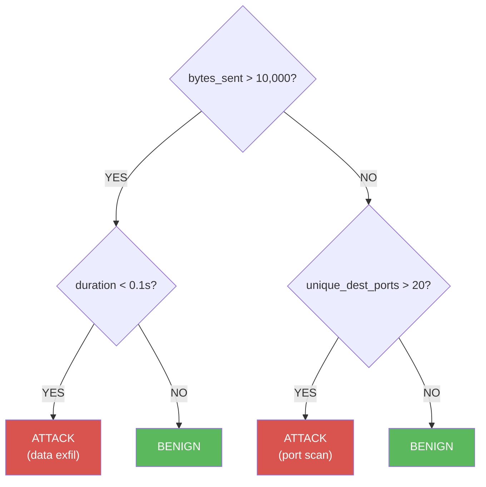

# Decision Trees

---

## Concept: Learning Rules from Data

A decision tree works exactly like a flowchart of yes/no questions:



The model learns *which questions to ask* and *at what thresholds* by finding the splits that best separate your classes in the training data.

---

## Real-Life Example: Network Traffic Classifier

Features from a network connection log:
- `duration` — how long the connection lasted (seconds)
- `bytes_sent` — total bytes transferred
- `packets_sent` — number of packets
- `unique_dest_ports` — how many different ports were contacted
- `connection_rate` — connections per minute from this IP

A port scan looks like: many connections, very short duration, many unique ports.
A data exfil looks like: long connection, large bytes_sent, few unique ports.

---

## Why Decision Trees Matter in Security

1. **Interpretable** — you can explain exactly why a connection was flagged
2. **No scaling needed** — unlike logistic regression, raw values work fine
3. **Handles non-linear patterns** — can capture complex threshold combinations
4. **Basis for Random Forests** — Stage 2 builds on this

---

## Key Concepts

### How splits are chosen
At each node, the tree tries every possible split on every feature and picks the one that best separates the classes. It measures separation with **Gini impurity** or **entropy**.

### Overfitting
An unconstrained tree will memorise the training data perfectly — but fail on new data. You control this with:
- `max_depth` — limits how deep the tree grows
- `min_samples_split` — minimum samples needed to split a node

### Feature Importance
```python
model.feature_importances_
```
Tells you which features the tree relied on most. Great for understanding *why* your model works.

---

## Key sklearn API

Say you have extracted connection features (`duration`, `bytes_sent`, `unique_dest_ports`, etc.) from 10,000 network log entries, labelled either "Benign" or "Attack". Here's how you train the tree and visualise the rules it learned:

```python
from sklearn.tree import DecisionTreeClassifier, plot_tree

model = DecisionTreeClassifier(max_depth=4, random_state=42)
model.fit(X_train, y_train)

# Visualise the actual rules the model learned
plot_tree(model, feature_names=feature_names, class_names=['Benign', 'Attack'],
          filled=True, fontsize=8)
```

---

## What to Notice When You Run It

1. The visualised tree — read the actual rules the model learned
2. Feature importances — which network features are most informative?
3. Accuracy — compare to logistic regression from Lesson 1.3
4. Try increasing `max_depth` and see what happens to accuracy on train vs test

---

## Next Lesson

**[Lesson 1.5 — Model Evaluation](../05_model_evaluation/README.md):** Accuracy alone is misleading in security. Learn precision, recall, F1, and ROC curves — and understand *why* they matter when 99% of traffic is benign.

---

## Ready for the Workshop?

You have covered the concepts. Now build it yourself.

**[Open README.md](README.md)**

# Lesson 1.4 — Workshop Guide
## Network Traffic Classifier with Decision Trees

> Read first: [README.md](README.md)
> Reference: Each exercise has a matching solution file (e.g. `1_how_trees_make_decisions/solution_decision_trees.py`)

## What This Workshop Covers

In this workshop you will build a decision tree classifier that identifies four types of network traffic: benign, port_scan, exfiltration, and DoS. You will learn how decision trees split data, how to read the rules the model learned, how to identify the most informative network features, and how to tune tree depth to avoid overfitting.

## Exercise Overview

| # | Guide | Lab | Topic |
|---|-------|---------------|-------|
| 1 | [lecture.md](1_how_trees_make_decisions/lecture.md) | [handson.md](1_how_trees_make_decisions/handson.md) | The if/else concept, Gini impurity, information gain |
| 2 | [lecture.md](2_train_and_read_the_tree/lecture.md) | [handson.md](2_train_and_read_the_tree/handson.md) | DecisionTreeClassifier, plot_tree(), interpret rules |
| 3 | [lecture.md](3_feature_importance/lecture.md) | [handson.md](3_feature_importance/handson.md) | .feature_importances_, which network features matter most |
| 4 | [lecture.md](4_depth_and_overfitting/lecture.md) | [handson.md](4_depth_and_overfitting/handson.md) | max_depth sweep, train vs test accuracy, sweet spot |

## Running a Solution

```bash
cd "C:/Users/admin/Desktop/AI Basic Training"
python stage1_classic_ml/04_decision_trees/1_how_trees_make_decisions/solution_decision_trees.py
```
