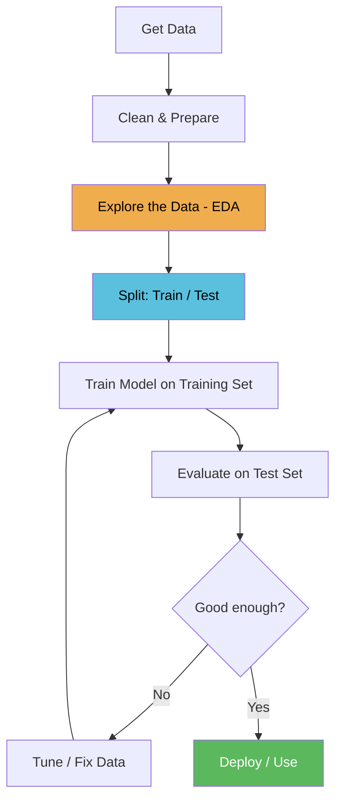
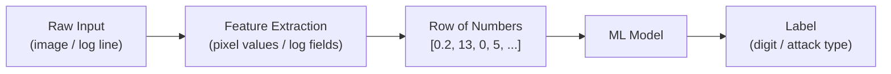

# Lesson 1.1 — What is Machine Learning?

**Script:** [1_concepts_and_data.py](1_concepts_and_data.py)

---

## Learning

### What is Machine Learning?

Traditional programming works like this: **you write the rules, the computer follows them**.

```
You write:   if "free money" in email -> mark as spam
             if sender not in contacts -> mark as spam
             if subject contains "URGENT" -> mark as spam

Computer:    applies your rules to every email
```

This works — until attackers learn your rules and work around them. Change one word, bypass the filter.

**Machine learning flips this**. Instead of writing rules, you show the computer thousands of examples with correct answers and let it figure out the rules itself.

```
You provide:  10,000 emails labelled spam or not spam
Computer:     finds its own patterns across all 10,000 examples
Result:       a model that generalises to emails it has never seen
```

The patterns the model finds are often things you would never think to write as a rule — combinations of dozens of subtle signals that together indicate spam. This is why ML outperforms hand-crafted rules on complex problems.

---

### The Three Types of Machine Learning

#### 1. Supervised Learning
You provide labelled examples: every sample has a correct answer attached.

```
Input: [url_length=92, num_dots=5, has_at_symbol=1, ...]
Label: phishing

Input: [url_length=14, num_dots=1, has_at_symbol=0, ...]
Label: legitimate
```

The model learns the mapping from inputs to labels. **This is the most widely used type in security** and the focus of Modules 1 and 2.

Security examples:
- Phishing URL classifier (lesson 1.3)
- Malware vs benign file classifier (lesson 2.2)
- Network intrusion detector (Module 2 milestone)

#### 2. Unsupervised Learning
No labels. The algorithm finds structure in the data on its own.

```
Input: [bytes_sent, duration, unique_ports, ...]  (no label)
Output: "this connection looks different from all the others"
```

Useful in security when you don't have labelled attack data — which is most of the time. You don't need to know what an attack looks like; you just need to know when something looks different from normal.

Security examples:
- Anomaly detection in network traffic (lesson 2.3)
- Clustering user behaviour to find outliers

#### 3. Reinforcement Learning
The model learns by trial and error, receiving rewards for good decisions and penalties for bad ones. Less common in security day-to-day, but increasingly used in:
- Automated penetration testing agents
- Adaptive threat response systems

---

### How a Model Actually Learns

When we say a model "learns," here is what is actually happening:

1. The model makes a prediction on a training sample
2. We compare the prediction to the correct label — this difference is the **loss**
3. The model adjusts its internal numbers (called **weights**) slightly to reduce the loss
4. Repeat for every sample, thousands of times

After enough repetitions, the weights settle into values that produce correct predictions — not just on training data, but on new data the model has never seen.

```
Epoch 1:  Loss = 0.92  (model is mostly guessing)
Epoch 10: Loss = 0.41  (model is learning patterns)
Epoch 50: Loss = 0.08  (model is now reliable)
```

You don't write any of this — the ML framework (scikit-learn, Keras) handles it automatically. But understanding that this process is happening is essential for debugging when things go wrong.

---

### The ML Workflow

Every ML project — toy example or production security tool — follows the same loop:



**Why the train/test split matters:**
If you evaluate the model on the same data you trained it on, you are not measuring how well it generalises — you are measuring how well it memorised. A model can score 100% on training data by memorising every example without learning anything useful. The test set is data the model has never seen, so it gives you an honest measure of real-world performance.

This is why Step C (EDA) comes before training — not after. You need to understand the data before deciding how to model it.

---

### What is EDA and Why Does It Matter?

**Exploratory Data Analysis (EDA)** is the practice of thoroughly examining your data before writing a single line of model code.

Skipping EDA is one of the most common reasons ML projects fail silently — the model trains without errors, produces numbers that look reasonable, but performs terribly in production because a problem in the data was never caught.

**What you are looking for during EDA:**

#### Class Balance
How many examples do you have of each class?

```
Normal traffic:  950,000 connections   (95%)
Attack traffic:    50,000 connections   (5%)
```

A model trained on this data can achieve 95% accuracy by predicting "normal" for everything — catching zero attacks. This is the **class imbalance problem**, and it is endemic in security ML. You will deal with it properly in Module 2.

#### Missing Values
Real-world log data often has gaps — fields that weren't captured, sensors that went offline, logs that were truncated.

```python
df.isnull().sum()   # count missing values per column
```

A model fed columns with missing values will behave unpredictably. You need to either fill them in (imputation) or drop them before training.

#### Feature Distributions
What range of values does each feature take? Are there extreme outliers?

```
bytes_sent: min=0, max=2,400,000,000
           most values are under 100,000
           a few are in the billions  <- outliers may be errors or attacks
```

Understanding distributions tells you whether scaling is needed, whether outliers should be removed or kept, and which features are likely to be informative.

#### Data Leakage
Sometimes a feature accidentally contains information about the label that would not be available at prediction time.

Example: if your dataset includes a column `was_flagged_by_ids`, that feature will make the model look incredible during training — but it would never be available in a real deployment.

---

### The Vocabulary You Need

| Term | Plain English |
|------|--------------|
| **Feature** | One measurable input. A URL's length is a feature. Bytes sent is a feature. |
| **Label / Target** | The answer. What we want the model to predict (phishing=1, legit=0). |
| **Sample / Instance** | One row of data. One URL. One network connection. One email. |
| **Training set** | The data the model learns from. |
| **Test set** | Data held back to evaluate the model honestly. Never used during training. |
| **Model** | The mathematical function learned from training data. |
| **Weights / Parameters** | The numbers inside the model that get adjusted during training. |
| **Loss** | How wrong the model's predictions are. Training tries to minimise this. |
| **Epoch** | One full pass through the training data. |
| **Overfitting** | Model memorised training data but fails on new data. |
| **Underfitting** | Model is too simple to capture the pattern. |
| **Class imbalance** | One label appears far more often than others. Common in security. |

---

## Tools for This Lesson

### NumPy (`import numpy as np`)

NumPy is the foundational library for numerical computing in Python. It gives us **arrays** — fast, memory-efficient lists of numbers that support mathematical operations on the entire array at once.

```python
import numpy as np   # "np" is the universal shorthand — you will see it everywhere
```

Regular Python lists are slow for large datasets. A NumPy array of 1 million numbers can be multiplied by 2 in a single operation. This is critical when your dataset has millions of rows.

### Pandas (`import pandas as pd`)

Pandas gives us the **DataFrame** — a table of data, like a spreadsheet inside Python. Each row is one sample, each column is one feature.

```python
import pandas as pd   # "pd" is the universal alias

df = pd.DataFrame(data, columns=["feature_1", "feature_2", ...])
```

Key methods you will use constantly:

| Method | What it does |
|--------|-------------|
| `df.shape` | Returns (rows, columns) — always check this first |
| `df.head()` | Shows the first 5 rows |
| `df.describe()` | Min, max, mean, std for every column |
| `df.isnull().sum()` | Count missing values per column |
| `df["col"].value_counts()` | Count how many times each value appears |
| `df["col"].hist()` | Plot a histogram of a column's values |

### Matplotlib (`import matplotlib.pyplot as plt`)

Matplotlib is Python's core plotting library. We import the `pyplot` sub-module and alias it `plt`.

```python
import matplotlib.pyplot as plt   # "plt" is the universal alias
```

Key functions used in this lesson:

| Function | What it does |
|----------|-------------|
| `plt.subplots(rows, cols)` | Creates a grid of plot panels |
| `ax.imshow(array, cmap=...)` | Displays a 2D array as an image |
| `plt.show()` | Opens the plot window |
| `plt.savefig("file.png")` | Saves the plot to disk |
| `plt.tight_layout()` | Fixes spacing so panels don't overlap |

### scikit-learn (`from sklearn.datasets import load_digits`)

scikit-learn is the standard ML library in Python. It contains every classic algorithm plus utilities for data preparation and evaluation. We use it throughout Modules 1 and 2.

`load_digits()` loads a famous benchmark dataset that ships bundled inside scikit-learn — no internet connection needed.

---

## The Dataset

### Where It Comes From

In the early 1990s, researchers collected handwritten digit samples — people physically wrote the numbers 0–9 on paper, which was then scanned. Each digit image was cropped and downsampled to an 8×8 grid of pixel brightness values (0 = white, 16 = black). The result was published as the **Optical Recognition of Handwritten Digits** dataset on the UCI Machine Learning Repository, and has been a standard teaching dataset ever since.

### What `load_digits()` Returns

```python
digits = load_digits()
#
# digits.data         shape (1797, 64)     1797 images, 64 pixel values each
# digits.target       shape (1797,)        correct label for each image (0-9)
# digits.images       shape (1797, 8, 8)   same pixels as 8x8 grids (for plotting)
# digits.target_names array([0,1,...,9])   the list of class labels
```

### What `.shape` Means

`.shape` is a NumPy property that returns the dimensions of an array as a tuple:

```python
digits.data.shape      # (1797, 64)
#                          ^     ^
#                        rows  columns
#                        1797 images, 64 features each

digits.target.shape    # (1797,)  — a 1D array of 1797 labels
digits.images.shape    # (1797, 8, 8) — 1797 grids of 8 rows x 8 columns
```

### What the Data Looks Like

Each image is **flattened into a row of 64 numbers** before the model sees it:

```
  8x8 image          Flattened row (64 features)              Label
  [ pixel grid ]  -> [ 0, 0, 5, 13, 9, 1, 0, 0, ... ]  ->  "0"
  [ pixel grid ]  -> [ 0, 0, 0, 2, 16, 12, 0, 0, ... ] ->  "1"
  [ pixel grid ]  -> [ 0, 1, 12, 8, 0, 3, 14, 0, ... ] ->  "7"
```



---

## Hands-On: What the Script Does

### Step 1 — Load and wrap in a DataFrame

```python
digits = load_digits()

df = pd.DataFrame(
    digits.data,
    columns=[f"pixel_{i}" for i in range(64)]
)
df["target"] = digits.target
```

`f"pixel_{i}"` is an f-string — Python's way of embedding a variable inside a string. For i=0 it produces `"pixel_0"`, for i=1 `"pixel_1"`, and so on. This gives each of the 64 columns a readable name.

### Step 2 — Check the shape

```python
digits.data.shape[0]   # rows    = 1797 images
digits.data.shape[1]   # columns = 64 features per image
```

Always do this first. It confirms the data loaded correctly.

### Step 3 — Check class balance

```python
df["target"].value_counts().sort_index()
```

- `value_counts()` — counts how many rows have each label
- `sort_index()` — sorts by label value (0,1,2...) rather than by count
- Expected: ~178 examples per digit (well balanced)

### Step 4 — Visualise sample images

```python
fig, axes = plt.subplots(2, 10, figsize=(18, 4))
```

- `subplots(2, 10)` creates a 2-row, 10-column grid of panels — 2 examples per digit
- `figsize=(18, 4)` sets the figure size in inches

```python
ax.imshow(sample, cmap="gray_r")
```

- `imshow` renders the 8×8 number grid as a greyscale picture
- `cmap="gray_r"` — reversed greyscale: high numbers appear dark (bright pixels = ink)

### Step 5 — Print one image as raw numbers

This is the most important step for building intuition. The model sees this — not a picture:

```
   0   0   5  13   9   1   0   0
   0   0  13  15  10  15   5   0
   ...
```

### Step 6 — Plot average images per class

```python
digits.images[digits.target == digit].mean(axis=0)
```

- `digits.target == digit` — creates a True/False filter mask
- Applying it selects only the images of that digit
- `.mean(axis=0)` — averages all those images pixel by pixel, producing one 8×8 result

---

## What to Look for When You Run It

1. **Shape** — confirm you have 1797 rows and 64 features
2. **Class balance** — roughly 178–182 examples per digit
3. **Sample images** — recognisable digits; notice some are messier than others
4. **Average images** — spot which pairs of digits look most similar (1 and 7 are the hardest)

---

## Key Takeaways

> The model only ever sees rows of numbers. Your job is to make sure those numbers carry enough signal to find the pattern.

- EDA is not optional — skip it and you will miss problems that break your model silently
- Class balance matters enormously in security; always check it
- Understanding what your data looks like physically (visualising it) builds intuition that no amount of theory replaces

---

## Try It Yourself

```python
# Which pixels differ most between digit 0 and digit 1?
mean_0 = digits.data[digits.target == 0].mean(axis=0)
mean_1 = digits.data[digits.target == 1].mean(axis=0)
diff = abs(mean_0 - mean_1).reshape(8, 8)

plt.imshow(diff, cmap="hot")
plt.title("Pixel differences: 0 vs 1")
plt.colorbar()
plt.show()
# Bright areas = pixels that differ a lot = most useful features for separating these classes
```

---

## Next Lesson

**[Lesson 1.2 — Linear Regression](2_linear_regression.md):** Your first ML model — predict server response time from traffic load and understand what "learning" looks like in practice.
