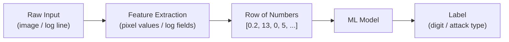

# Lesson 1.1 — What is ML? Exploring Data

**Script:** [1_concepts_and_data.py](1_concepts_and_data.py)

---

## Concept: Before You Train Anything, Look at Your Data

One of the most common mistakes beginners make is jumping straight into training a model without understanding what the data looks like. Every experienced ML practitioner spends significant time on **exploratory data analysis (EDA)** first.

In cybersecurity terms: you wouldn't write detection rules without first looking at what the malicious traffic actually looks like. Same principle.

---

## Tools We Use in This Lesson

Before diving in, here is what every import in the script does and why we use it.

### NumPy (`import numpy as np`)

NumPy is the foundational library for numerical computing in Python. It gives us **arrays** — fast, memory-efficient lists of numbers that support mathematical operations on the entire array at once.

```python
import numpy as np   # "np" is a universally-used shorthand alias
```

We use it here for array operations on pixel data. In later lessons it becomes essential for working with model weights and feature matrices.

### Pandas (`import pandas as pd`)

Pandas gives us the **DataFrame** — think of it as a spreadsheet or database table inside Python. Each row is one sample (one image), each column is one feature (one pixel value).

```python
import pandas as pd   # "pd" is the universal alias

df = pd.DataFrame(data, columns=["pixel_0", "pixel_1", ...])
#  ^                ^
#  "df" = DataFrame  columns gives each column a name
```

Why use a DataFrame instead of a plain list?
- `.head()` — see the first 5 rows instantly
- `.shape` — check how many rows and columns you have
- `.describe()` — get min, max, mean, std for every column in one call
- `.value_counts()` — count how many times each value appears

You'll use DataFrames in every ML project you ever build.

### Matplotlib (`import matplotlib.pyplot as plt`)

Matplotlib is Python's core plotting library. We import the `pyplot` sub-module and alias it as `plt`.

```python
import matplotlib.pyplot as plt   # "plt" is the universal alias

plt.imshow(image)    # display an image
plt.show()           # render and open the plot window
plt.savefig("out.png")  # save to disk instead
```

### scikit-learn (`from sklearn.datasets import load_digits`)

scikit-learn is the standard ML library in Python — it contains every classic algorithm (logistic regression, decision trees, random forests) plus utilities for data prep and evaluation. We use it throughout Modules 1 and 2.

`load_digits()` is a convenience function that loads a well-known dataset that ships bundled with scikit-learn. No download needed.

---

## The Dataset We Use

### Where It Comes From

The digits dataset has a straightforward origin. In the early 1990s, researchers collected handwritten digit samples — people physically wrote the numbers 0–9 on paper. The paper was scanned, and each digit image was cropped and downsampled to an 8×8 grid of pixel brightness values (0 = white, 16 = black).

The result was published as the **Optical Recognition of Handwritten Digits** dataset on the UCI Machine Learning Repository, one of the oldest and most widely used archives of ML datasets. It has been a standard teaching and benchmarking dataset ever since.

When you call `load_digits()`, scikit-learn loads that data directly from a file bundled inside the package — no internet connection, no download. It is always available.

---

### What `load_digits()` Returns

```python
digits = load_digits()

digits.data    # a NumPy array of shape (1797, 64)
               # 1797 images, each described by 64 pixel values
               # one row = one image

digits.target  # a NumPy array of shape (1797,)
               # the correct label for each image — a number 0 through 9

digits.images  # a NumPy array of shape (1797, 8, 8)
               # the same pixel data, but kept as 8x8 grids (useful for plotting)

digits.target_names  # array([0, 1, 2, 3, 4, 5, 6, 7, 8, 9])
                     # the list of all possible class labels
```

### What `.shape` Means

`.shape` is a NumPy property that tells you the dimensions of an array:

```python
digits.data.shape        # (1797, 64)
                         #   ^     ^
                         # rows  columns
                         # 1797 images, 64 features each

digits.target.shape      # (1797,)  — a 1D array of 1797 labels
digits.images.shape      # (1797, 8, 8)  — 1797 grids, each 8 rows by 8 columns
```

---

### What the Data Actually Looks Like

Each image is **flattened into a row of 64 numbers** before the model sees it:

```
  8x8 image          Flattened row (64 features)           Label
  [ pixel grid ]  ->  [ 0, 0, 5, 13, 9, 1, 0, 0, ... ]  ->  "0"
  [ pixel grid ]  ->  [ 0, 0, 0, 2, 16, 12, 0, 0, ... ] ->  "1"
  [ pixel grid ]  ->  [ 0, 1, 12, 8, 0, 3, 14, 0, ... ] ->  "7"
```

The model never sees the picture — only the numbers. This is exactly how security ML works: a network connection becomes a row of numbers (bytes sent, packets per second, port, protocol...) and the model learns to classify it from those numbers alone.



---

## What the Script Does

### Step 1 — Load and wrap in a DataFrame

```python
digits = load_digits()

df = pd.DataFrame(digits.data, columns=[f"pixel_{i}" for i in range(64)])
#                 ^^^^^^^^^^^   ^^^^^^^^^^^^^^^^^^^^^^^^^^^^^^^^^^^^^^^^^^^^
#                 the raw data  give each column a readable name: pixel_0, pixel_1 ...

df["target"] = digits.target
# add a column called "target" with the correct digit label for each row
```

### Step 2 — Check the shape

```python
digits.data.shape[0]   # number of rows  (images)  = 1797
digits.data.shape[1]   # number of columns (features) = 64
```

Always check shape first. It tells you immediately whether your data loaded correctly and how much you have to work with.

### Step 3 — Check class balance

```python
df["target"].value_counts().sort_index()
# value_counts() counts how many rows have each label
# sort_index()   sorts the result by label (0,1,2...) instead of by count
```

Expected output:
```
0    178
1    182
2    177
...
```

This dataset is well-balanced — roughly equal examples of each digit. In security data this is rarely true: you might have millions of normal connections and only hundreds of attacks. That imbalance matters enormously — you'll deal with it properly in Module 2.

### Step 4 — Visualise sample images

```python
fig, axes = plt.subplots(2, 10, figsize=(18, 4))
# subplots creates a grid of plot panels
# (2, 10) = 2 rows, 10 columns = 20 panels total (2 examples per digit)
# figsize=(18, 4) = width 18 inches, height 4 inches

ax.imshow(sample, cmap="gray_r")
# imshow displays a 2D array as an image
# cmap="gray_r" = reversed greyscale: high values are dark, low are light
```

This is your sanity check — do the images look like what you'd expect?

### Step 5 — Print one image as raw numbers

This step makes the most important point of the lesson: the model sees this, not a picture:

```
   0   0   5  13   9   1   0   0
   0   0  13  15  10  15   5   0
   ...
```

### Step 6 — Plot average images per class

```python
digits.images[digits.target == digit].mean(axis=0)
# digits.target == digit  creates a True/False mask
# applying it filters to only images of that digit
# .mean(axis=0) averages across all those images, pixel by pixel
```

---

## What to Look for When You Run It

1. **Shape** — 1797 rows, 64 features
2. **Class balance** — roughly 178–182 examples per digit (well balanced)
3. **Sample images** — recognisable digits, some messier than others
4. **Average images** — each digit has a distinct shape; `1` and `7` are the most visually similar

---

## The Key Takeaway

> The model only ever sees rows of numbers. Your job is to make sure those numbers carry enough signal to find the pattern.

Before any training, ask:
- How many samples do I have?
- Are the classes balanced?
- Do the features look meaningful?
- Are there missing values? (`df.isnull().sum()`)

---

## Try It Yourself

```python
# Which pixel positions differ most between digit 0 and digit 1?
mean_0 = digits.data[digits.target == 0].mean(axis=0)
mean_1 = digits.data[digits.target == 1].mean(axis=0)
diff = abs(mean_0 - mean_1).reshape(8, 8)

import matplotlib.pyplot as plt
plt.imshow(diff, cmap="hot")
plt.title("Pixel differences between 0 and 1")
plt.colorbar()
plt.show()
# Bright pixels = differ a lot between classes = most useful features for the model
```

---

## Next Lesson

**[Lesson 1.2 — Linear Regression](2_linear_regression.md):** Predict a continuous number (server response time from traffic volume) using your first ML model.
