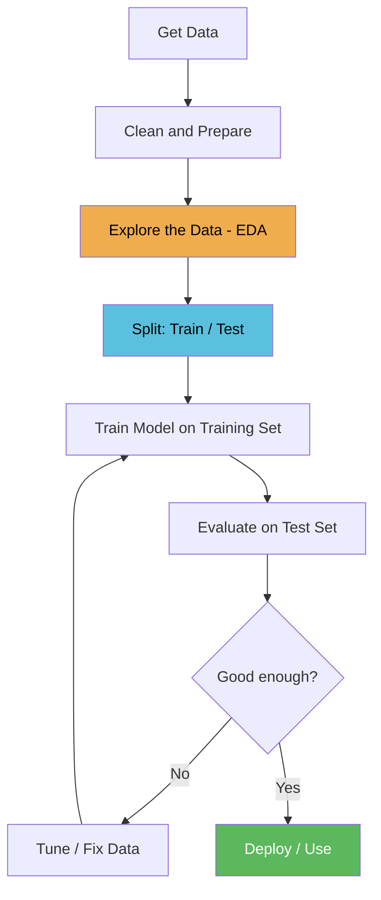

# Lesson 1.1 — What is Machine Learning?

> **Reference solution:** [1_concepts_and_data.py](1_concepts_and_data.py)
> Build your own version step by step in this guide. Use the reference only to check your work at the end.

---

## What is Machine Learning?

Traditional programming works like this: **you write the rules, the computer follows them**.

```
You write:   if "free money" in email -> mark as spam
             if sender not in contacts -> mark as spam
             if subject contains "URGENT" -> mark as spam

Computer:    applies your rules to every email
```

This works — until attackers learn your rules and work around them. Change one word, bypass the filter.

**Machine learning flips this**. Instead of writing rules, you show the computer thousands of examples with correct answers and let it figure out the rules itself.

```
You provide:  10,000 emails labelled spam or not spam
Computer:     finds its own patterns across all 10,000 examples
Result:       a model that generalises to emails it has never seen
```

The patterns a model finds are often combinations of dozens of subtle signals that no human would think to write as a rule. This is why ML outperforms hand-crafted rules on complex problems.


---

## The Three Types of Machine Learning


### Supervised Learning

You provide labelled examples — every sample has a correct answer attached. The model learns the mapping from inputs to labels.

```
Input:  [url_length=92, num_dots=5, has_at_symbol=1, ...]
Label:  phishing

Input:  [url_length=14, num_dots=1, has_at_symbol=0, ...]
Label:  legitimate
```

**This is the most widely used type in security** and the focus of Modules 1 and 2.

Security examples: phishing URL classifier, malware vs benign file classifier, network intrusion detector.

### Unsupervised Learning

No labels. The algorithm finds structure in the data on its own.

```
Input:  [bytes_sent, duration, unique_ports, ...]  (no label)
Output: "this connection looks different from all the others"
```

You don't need to know what an attack looks like — you just need to know when something looks different from normal. Security examples: anomaly detection in network traffic, clustering user behaviour to find outliers.

### Reinforcement Learning

The model learns by trial and error, receiving rewards for correct decisions and penalties for bad ones. Less common in security day-to-day, but increasingly used in automated penetration testing agents and adaptive threat response.

---

## How a Model Actually Learns

When we say a model "learns," here is what is actually happening:

1. The model makes a prediction on a training sample
2. We compare the prediction to the correct label — this difference is the **loss**
3. The model adjusts its internal numbers (called **weights**) slightly to reduce the loss
4. Repeat for every sample, thousands of times

After enough repetitions, the weights settle into values that produce correct predictions on data the model has never seen.

```
Epoch 1:  Loss = 0.92  (model is mostly guessing)
Epoch 10: Loss = 0.41  (model is learning patterns)
Epoch 50: Loss = 0.08  (model is now reliable)
```

You don't write any of this — the ML library handles it automatically. But understanding that this process is happening is essential for debugging when things go wrong.

---

## The ML Workflow

Every ML project follows the same loop:



**Why the train/test split matters:**
If you evaluate the model on the same data you trained it on, you are measuring how well it memorised — not how well it generalises. The test set is data the model has never seen, so it gives an honest measure of real-world performance. A model can score 100% on training data by memorising every example without learning anything useful.

---

## What is EDA and Why Does It Matter?

**Exploratory Data Analysis (EDA)** is the practice of thoroughly examining your data before writing a single line of model code.

Skipping EDA is one of the most common reasons ML projects fail silently — the model trains without errors, looks reasonable, but performs terribly in production because a problem in the data was never caught.

**What you are looking for:**

### Class Balance

How many examples do you have of each class?

```
Normal traffic:  950,000 connections   (95%)
Attack traffic:    50,000 connections   (5%)
```

A model trained on this can achieve 95% accuracy by predicting "normal" for everything — catching zero attacks. This is the **class imbalance problem**, and it is everywhere in security.


### Missing Values

Real-world log data often has gaps — fields that weren't captured, sensors that went offline, truncated logs. A model fed missing values will behave unpredictably.

### Feature Distributions

What range of values does each feature take? Are there outliers?

```
bytes_sent: min=0, max=2,400,000,000
           most values are under 100,000
           a few are in the billions  <- could be errors or attacks
```

### Data Leakage

Sometimes a feature accidentally contains information about the label that would not be available at prediction time. Example: a column `was_flagged_by_ids` would make the model look perfect during training — but it would never exist when the model is deployed on live traffic.

---

## Vocabulary Reference

| Term | Plain English |
|------|--------------|
| **Feature** | One measurable input — URL length, bytes sent, port number |
| **Label / Target** | The answer the model predicts — phishing=1, legitimate=0 |
| **Sample** | One row of data — one URL, one connection, one log entry |
| **Training set** | The data the model learns from |
| **Test set** | Data held back to evaluate the model honestly — never used during training |
| **Model** | The mathematical function learned from training data |
| **Weights** | The numbers inside the model adjusted during training |
| **Loss** | How wrong the model's predictions are — training minimises this |
| **Epoch** | One full pass through the training data |
| **Overfitting** | Model memorised training data but fails on new data |
| **Underfitting** | Model is too simple to capture the real pattern |
| **Class imbalance** | One label appears far more often than others — common in security |

---

## Tools in This Lesson

| Library | What it is | Alias |
|---------|-----------|-------|
| **NumPy** | Fast numerical arrays — the foundation of all ML in Python | `np` |
| **pandas** | DataFrames — tabular data, like a spreadsheet in Python | `pd` |
| **Matplotlib** | Plotting and visualisation | `plt` |
| **scikit-learn** | Classic ML algorithms, datasets, evaluation tools | `sklearn` |

These are the four most-used libraries in all of data science. You will use them in every lesson.

---

---

# Lab — Build the Exploration Script Yourself

You now have enough background to write this from scratch. Follow the steps below. Each step tells you exactly what to type, then shows you what the output should look like.

**The goal:** by the end of this lab, you will have your own working script that loads a dataset and explores it thoroughly — the same process you will repeat on every ML project.

---

## Before You Start

**Create a new file** in this folder called `my_lab_1_1.py`.

Open it in VS Code. This is your working file. Write all the code from these steps into it.

> The complete reference solution is in [1_concepts_and_data.py](1_concepts_and_data.py).
> Do not open it yet. Try to build it yourself first.

---

## Step 1 — Import Your Tools

Every data science script starts with the same four imports. Type this at the top of your file:

```python
import numpy as np
import pandas as pd
import matplotlib.pyplot as plt
from sklearn.datasets import load_digits
```

**What each one is:**

- `numpy` — fast numerical arrays. Everything in ML is arrays of numbers. Alias `np` is universal.
- `pandas` — DataFrames, like a spreadsheet you can query in code. Alias `pd` is universal.
- `matplotlib.pyplot` — plots and charts. Alias `plt` is universal.
- `load_digits` — a function inside scikit-learn that gives us a ready-made dataset of handwritten digits. No download needed.

**Run it:**
```
python module1_classic_ml/lesson1/my_lab_1_1.py
```

**Expected output:** nothing. No errors = success. Python imported the libraries cleanly.

---

## Step 2 — Load the Dataset

Add this below your imports:

```python
digits = load_digits()

df = pd.DataFrame(
    digits.data,
    columns=[f"pixel_{i}" for i in range(64)]
)
df["target"] = digits.target
```

**What is happening:**

`load_digits()` returns an object with several fields inside it:
- `digits.data` — shape `(1797, 64)`: 1797 images, each flattened to 64 pixel values
- `digits.target` — shape `(1797,)`: the correct label (0–9) for each image
- `digits.images` — shape `(1797, 8, 8)`: same pixels but arranged as 8×8 grids for plotting

We then wrap the raw numbers in a DataFrame so we can inspect them easily. `f"pixel_{i}"` is an f-string — Python fills in the variable: `pixel_0`, `pixel_1`, ..., `pixel_63`.

The last line adds a `target` column so each row has 64 pixel features plus its correct label.

**Run it.** Still no printed output — we have loaded the data into memory but haven't printed anything yet.

---

## Step 3 — Check Shape and Basic Statistics

Add this:

```python
print("=" * 60)
print("STEP 2 - Shape and Basic Statistics")
print("=" * 60)

print(f"\nRows    : {digits.data.shape[0]}  (each row = one image)")
print(f"Columns : {digits.data.shape[1]}  (each column = one pixel feature)")
print(f"Classes : {list(digits.target_names)}")
print(f"\nPixel value range: min={digits.data.min():.0f}, max={digits.data.max():.0f}")
print("(0 = white background, 16 = black ink)")
```

**Run it.**

**Expected output:**
```
============================================================
STEP 2 - Shape and Basic Statistics
============================================================

Rows    : 1797  (each row = one image)
Columns : 64  (each column = one pixel feature)
Classes : [0, 1, 2, 3, 4, 5, 6, 7, 8, 9]

Pixel value range: min=0, max=16
(0 = white background, 16 = black ink)
```

This confirms the data loaded correctly. Always do this first on any new dataset.

---

## Step 4 — Check Class Balance

Add this:

```python
print("\n" + "=" * 60)
print("STEP 3 - Class Balance")
print("=" * 60)

print("\nSamples per digit:")
print(df["target"].value_counts().sort_index().to_string())
```

**What is happening:**

- `value_counts()` counts how many rows have each unique value in the `target` column
- `sort_index()` sorts by digit label (0, 1, 2...) rather than by count
- `to_string()` prints the full result without pandas truncating it

**Run it.**

**Expected output:**
```
============================================================
STEP 3 - Class Balance
============================================================

Samples per digit:
0    178
1    182
2    177
3    183
4    181
5    182
6    181
7    179
8    174
9    180
```

This dataset is well balanced — roughly 178 examples per digit. In real security work this is rare. A network dataset might have 950,000 normal connections and 50,000 attacks. A model that always predicts "normal" scores 95% accuracy but catches zero attacks. Checking balance before training is non-negotiable.

---

## Step 5 — Visualise Sample Images

Add this:

```python
print("\n" + "=" * 60)
print("STEP 4 - Sample Images (see plot window)")
print("=" * 60)

fig, axes = plt.subplots(2, 10, figsize=(18, 4))
fig.suptitle("Two examples of each digit class (0-9)", fontsize=12)

for digit in range(10):
    samples = digits.images[digits.target == digit]
    for row, sample in zip(axes, samples[:2]):
        row[digit].imshow(sample, cmap="gray_r")
        row[digit].set_title(str(digit))
        row[digit].axis("off")

plt.tight_layout()
plt.savefig("module1_classic_ml/lesson1/sample_digits.png")
plt.show()
```

**What is happening:**

- `plt.subplots(2, 10)` creates a grid of 20 panels — 2 rows, 10 columns (one column per digit)
- `digits.target == digit` produces a True/False mask that filters only images of that digit
- `imshow(..., cmap="gray_r")` renders the 8×8 number array as a greyscale image
- `plt.savefig(...)` saves the figure to disk so you can refer back to it

**Run it.** A window should open showing 20 digit images.

**What to look for:** Are the digits recognisable? Some will look messy — handwriting is inconsistent. The messier the digit, the harder the model has to work to classify it correctly.

---

## Step 6 — See What the Model Actually Sees

This is the most important step. The model never sees a picture. It sees a flat row of 64 numbers.

Add this:

```python
print("\n" + "=" * 60)
print("STEP 5 - One Image as Raw Numbers")
print("=" * 60)

print("\nThe first image in the dataset, printed as its 8x8 pixel grid:")
print("(0 = white background, 16 = black ink)\n")

sample_image = digits.images[0]
for row in sample_image.astype(int):
    print("  " + "  ".join(f"{v:2d}" for v in row))

print(f"\n  ^ This is the digit '{digits.target[0]}'")
print("\nThis row of 64 numbers is exactly what the model will receive as input.")
```

**Run it.**

**Expected output:**
```
============================================================
STEP 5 - One Image as Raw Numbers
============================================================

The first image in the dataset, printed as its 8x8 pixel grid:
(0 = white background, 16 = black ink)

   0   0   5  13   9   1   0   0
   0   0  13  15  10  15   5   0
   0   3  15   2   0  11   8   0
   0   4  12   0   0   8   8   0
   0   5   8   0   0   9   8   0
   0   4  11   0   1  12   7   0
   0   2  14   5  10  12   0   0
   0   0   6  13  10   0   0   0

  ^ This is the digit '0'

This row of 64 numbers is exactly what the model will receive as input.
```

**The analogy to security:** Instead of pixel values, your features would be `bytes_per_second`, `unique_ports`, `entropy`, `protocol_flags`. The model sees the same structure — a flat row of numbers — regardless of whether the domain is image recognition or network intrusion detection.

---

## Step 7 — Average Image per Class

Add this:

```python
print("\n" + "=" * 60)
print("STEP 6 - Average Images per Class (see plot window)")
print("=" * 60)

fig, axes = plt.subplots(1, 10, figsize=(18, 2))
fig.suptitle("Average pixel pattern per digit class", fontsize=12)

for digit, ax in enumerate(axes):
    mean_image = digits.images[digits.target == digit].mean(axis=0)
    ax.imshow(mean_image, cmap="gray_r")
    ax.set_title(str(digit))
    ax.axis("off")

plt.tight_layout()
plt.savefig("module1_classic_ml/lesson1/average_digits.png")
plt.show()

print("What to look for: which digits have the most similar average shapes?")
print("Hint: look at 1 vs 7, and 3 vs 8. Those pairs will have higher confusion rates.")
```

**What is happening:**

- `.mean(axis=0)` averages all images of one digit, pixel by pixel, to produce a single "prototype" image
- If two prototypes look nearly identical, the model will struggle to tell those digits apart — this is a quick way to predict where errors will occur before you train anything

**Run it.** Observe which digit pairs look most similar. In the next lesson you will train a model and see whether those pairs do in fact have higher error rates.

---

## Finished — Compare Your Solution

Your script is complete. It should now:

1. Load 1,797 digit images
2. Print shape, pixel range, and class balance
3. Display two sample images per digit class
4. Print one image as raw numbers
5. Display the average shape of each digit class

**Now open [1_concepts_and_data.py](1_concepts_and_data.py)** and compare it to what you wrote.

Things to notice:
- The structure is identical to what you built — you wrote the same program
- The reference version has more inline comments explaining each line
- The exercises section at the bottom extends what you built — try them

---

## Exercises

These are in the reference script as commented-out blocks. Try each one after the main script runs cleanly — uncomment, run, observe, re-comment, move to the next.

| Exercise | What it explores |
|----------|-----------------|
| 1 | Which pixels differ most between digit 0 and digit 1? |
| 2 | Are there any missing values? (Try `df.isnull().sum()`) |
| 3 | Distribution of a single pixel across all 1,797 images |
| 4 | Which pixels are most correlated with the target label? |

---

## Next Lesson

**[Lesson 1.2 — Linear Regression](../lesson2/2_linear_regression.md):** Your first ML model — predict server response time from traffic load.
