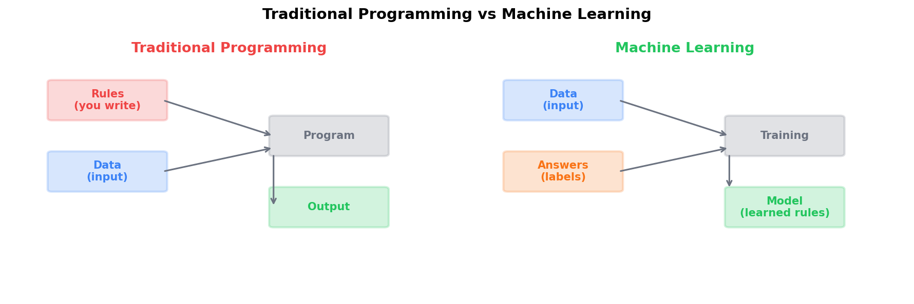
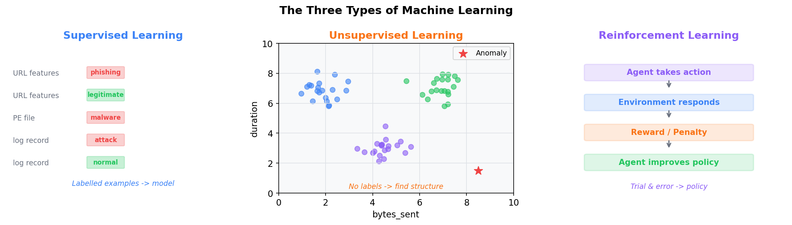
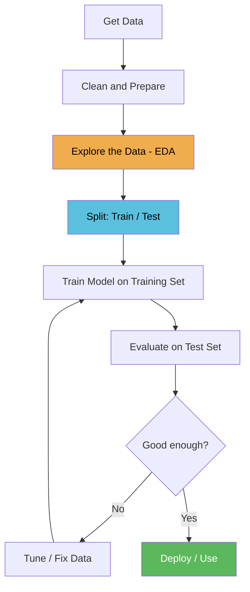
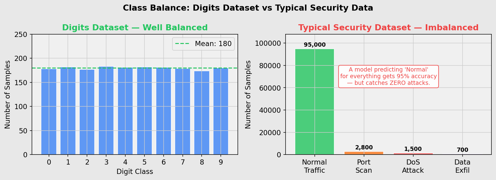

# Lesson 1.1 — What is Machine Learning?

---

## What is Machine Learning?

Traditional programming works like this: **you write the rules, the computer follows them**.

```
You write:   if "free money" in email -> mark as spam
             if sender not in contacts -> mark as spam
             if subject contains "URGENT" -> mark as spam

Computer:    applies your rules to every email
```

This works — until attackers learn your rules and work around them. Change one word, bypass the filter.

**Machine learning flips this**. Instead of writing rules, you show the computer thousands of examples with correct answers and let it figure out the rules itself.

```
You provide:  10,000 emails labelled spam or not spam
Computer:     finds its own patterns across all 10,000 examples
Result:       a model that generalises to emails it has never seen
```

The patterns a model finds are often combinations of dozens of subtle signals that no human would think to write as a rule. This is why ML outperforms hand-crafted rules on complex problems.



---

## The Three Types of Machine Learning



### Supervised Learning

You provide labelled examples — every sample has a correct answer attached. The model learns the mapping from inputs to labels.

```
Input:  [url_length=92, num_dots=5, has_at_symbol=1, ...]
Label:  phishing

Input:  [url_length=14, num_dots=1, has_at_symbol=0, ...]
Label:  legitimate
```

**This is the most widely used type in security** and the focus of Modules 1 and 2.

Security examples: phishing URL classifier, malware vs benign file classifier, network intrusion detector.

### Unsupervised Learning

No labels. The algorithm finds structure in the data on its own.

```
Input:  [bytes_sent, duration, unique_ports, ...]  (no label)
Output: "this connection looks different from all the others"
```

You don't need to know what an attack looks like — you just need to know when something looks different from normal. Security examples: anomaly detection in network traffic, clustering user behaviour to find outliers.

### Reinforcement Learning

The model learns by trial and error, receiving rewards for correct decisions and penalties for bad ones. Less common in security day-to-day, but increasingly used in automated penetration testing agents and adaptive threat response.

---

## How a Model Actually Learns

When we say a model "learns," here is what is actually happening:

1. The model makes a prediction on a training sample
2. We compare the prediction to the correct label — this difference is the **loss**
3. The model adjusts its internal numbers (called **weights**) slightly to reduce the loss
4. Repeat for every sample, thousands of times

After enough repetitions, the weights settle into values that produce correct predictions on data the model has never seen.

```
Epoch 1:  Loss = 0.92  (model is mostly guessing)
Epoch 10: Loss = 0.41  (model is learning patterns)
Epoch 50: Loss = 0.08  (model is now reliable)
```

You don't write any of this — the ML library handles it automatically. But understanding that this process is happening is essential for debugging when things go wrong.

---

## The ML Workflow

Every ML project follows the same loop:



**Why the train/test split matters:**
If you evaluate the model on the same data you trained it on, you are measuring how well it memorised — not how well it generalises. The test set is data the model has never seen, so it gives an honest measure of real-world performance. A model can score 100% on training data by memorising every example without learning anything useful.

---

## What is EDA and Why Does It Matter?

**Exploratory Data Analysis (EDA)** is the practice of thoroughly examining your data before writing a single line of model code.

Skipping EDA is one of the most common reasons ML projects fail silently — the model trains without errors, looks reasonable, but performs terribly in production because a problem in the data was never caught.

**What you are looking for:**

### Class Balance

How many examples do you have of each class?

```
Normal traffic:  950,000 connections   (95%)
Attack traffic:    50,000 connections   (5%)
```

A model trained on this can achieve 95% accuracy by predicting "normal" for everything — catching zero attacks. This is the **class imbalance problem**, and it is everywhere in security.



### Missing Values

Real-world log data often has gaps — fields that weren't captured, sensors that went offline, truncated logs. A model fed missing values will behave unpredictably.

### Feature Distributions

What range of values does each feature take? Are there outliers?

```
bytes_sent: min=0, max=2,400,000,000
           most values are under 100,000
           a few are in the billions  <- could be errors or attacks
```

### Data Leakage

Sometimes a feature accidentally contains information about the label that would not be available at prediction time. Example: a column `was_flagged_by_ids` would make the model look perfect during training — but it would never exist when the model is deployed on live traffic.

---

## Vocabulary Reference

| Term | Plain English |
|------|--------------|
| **Feature** | One measurable input — URL length, bytes sent, port number |
| **Label / Target** | The answer the model predicts — phishing=1, legitimate=0 |
| **Sample** | One row of data — one URL, one connection, one log entry |
| **Training set** | The data the model learns from |
| **Test set** | Data held back to evaluate the model honestly — never used during training |
| **Model** | The mathematical function learned from training data |
| **Weights** | The numbers inside the model adjusted during training |
| **Loss** | How wrong the model's predictions are — training minimises this |
| **Epoch** | One full pass through the training data |
| **Overfitting** | Model memorised training data but fails on new data |
| **Underfitting** | Model is too simple to capture the real pattern |
| **Class imbalance** | One label appears far more often than others — common in security |

---

## Tools in This Lesson

| Library | What it is | Alias |
|---------|-----------|-------|
| **NumPy** | Fast numerical arrays — the foundation of all ML in Python | `np` |
| **pandas** | DataFrames — tabular data, like a spreadsheet in Python | `pd` |
| **Matplotlib** | Plotting and visualisation | `plt` |
| **scikit-learn** | Classic ML algorithms, datasets, evaluation tools | `sklearn` |

These are the four most-used libraries in all of data science. You will use them in every lesson.

---

## Ready for the Workshop?

**[Open workshop/1_lab_guide.md](workshop/1_lab_guide.md)** — 5 hands-on exercises that walk you through loading, inspecting, and visualising the dataset. Each exercise has a clear task and expected output. The reference solution is in `workshop/reference_solution.py`.

---

## Next Lesson

**[Lesson 1.2 — Linear Regression](../lesson2_linear_regression/2_linear_regression.md):** Your first trained model — predict server response time from network traffic load.
