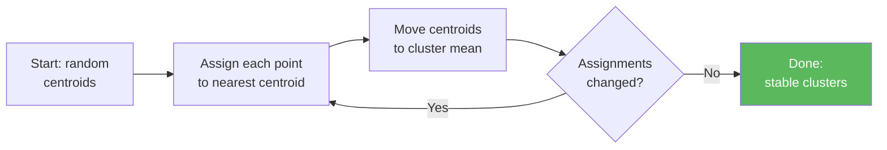

# Lesson 2.3 — k-Means Clustering (Unsupervised Learning)

**Script:** [3_clustering.py](3_clustering.py)

---

## Concept: Finding Groups Without Labels

In supervised learning, every training sample has a label. In unsupervised learning, **there are no labels** — the algorithm must find structure in the data on its own.

**k-Means clustering** groups data points into `k` clusters based on similarity. Points within the same cluster are close to each other; points in different clusters are far apart.

---

## Why This Matters for Security

You almost never have a perfectly labelled dataset of "attacks." What you *do* have is lots of connection logs. k-Means can:

1. Identify **behavioural clusters** in your network (normal users, servers, IoT devices)
2. Flag **outliers** — connections that don't belong to any known cluster
3. **Baseline normal behaviour** without needing a single labelled sample

> **"I don't need to know what an attack looks like. I just need to know when something looks different from normal."**

---

## How k-Means Works

1. Choose `k` (number of clusters)
2. Place `k` centroids randomly
3. Assign each point to the nearest centroid
4. Move each centroid to the mean of its assigned points
5. Repeat steps 3-4 until assignments stop changing

```
  bytes_sent
    ^
    |   o o           x x x         o = cluster 1 (normal traffic)
    |  o o o           x x          x = cluster 2 (heavy transfer)
    |   o o                         * = cluster 3 (short bursts)
    |                               ! = outlier (anomaly)
    |        * * *
    |         * *
    |          *
    |                        !
    +--------------------------> duration
```



---

## Choosing k: The Elbow Method

Plot inertia (sum of squared distances to nearest centroid) vs k. The "elbow" where the curve bends is usually the right k.

```python
inertias = []
for k in range(1, 11):
    km = KMeans(n_clusters=k).fit(X)
    inertias.append(km.inertia_)
```

---

## Anomaly Detection with Clustering

After clustering normal traffic:
1. Fit k-Means on baseline (known-good) data
2. For each new connection, measure its **distance to its nearest centroid**
3. If distance > threshold → flag as anomalous

```python
distances = km.transform(X_new).min(axis=1)
anomalies = X_new[distances > threshold]
```

---

## Key sklearn API

```python
from sklearn.cluster import KMeans
from sklearn.preprocessing import StandardScaler

scaler = StandardScaler()
X_scaled = scaler.fit_transform(X)

km = KMeans(n_clusters=3, random_state=42, n_init=10)
km.fit(X_scaled)

labels  = km.labels_          # cluster assignment per point
centers = km.cluster_centers_ # centroid coordinates
```

---

## Important: Always Scale Before Clustering

k-Means uses Euclidean distance. If `bytes_sent` ranges 0–1,000,000 and `duration` ranges 0–300, the bytes feature will dominate. StandardScaler normalises all features to the same scale.

---

## What to Notice When You Run It

1. The elbow plot — where does k-Means stop improving significantly?
2. The cluster visualisation — do the clusters make semantic sense?
3. The anomaly detection results — are the flagged connections actually unusual?

---

## Next Lesson

**[Lesson 2.4 — Cross-Validation & Overfitting](4_overfitting_cross_validation.md):** How to know if your model will actually work on new data — not just the data you trained on.
