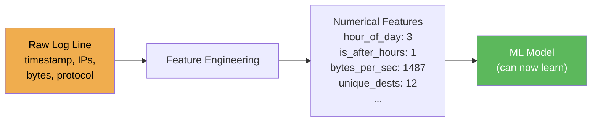

# Lesson 2.1 — Feature Engineering

---

## Concept: Turning Raw Data into ML-Ready Features

Raw log data looks like this:
```
2024-01-15 03:42:17 | 192.168.1.5 | 185.23.44.102:443 | 3421 bytes | TCP | 2.3s
```

A machine learning model can't learn from strings and timestamps. You need to **extract numerical features** that capture the signal:



This transformation is called **feature engineering**, and it's often where the most value comes from in a real ML project.

---

## Types of Features to Extract from Security Logs

Assume you have loaded a week of firewall logs into a pandas DataFrame. Each row is one connection, with columns like `timestamp`, `src_ip`, `dest_ip`, `bytes`, `duration`, `protocol`, and `bytes_uploaded`. Here is how you derive useful features from that raw data:

### Time-based features
Attackers often exfiltrate data or run scans at off-hours. Extract when the connection happened:

```python
df['hour_of_day']    = df['timestamp'].dt.hour
df['is_after_hours'] = df['hour_of_day'].apply(lambda h: 1 if h < 6 or h > 22 else 0)
df['day_of_week']    = df['timestamp'].dt.dayofweek
```

### Aggregation features (per IP, per session)
A single connection looks innocent; the pattern across many connections reveals the attacker. Ask how each IP behaves in aggregate:

```python
# How many unique destinations did this IP contact?
df['unique_dests_1h'] = df.groupby('src_ip')['dest_ip'].transform('nunique')
```

### Ratio features
Ratios compress two columns into one signal — bytes-per-second captures transfer speed regardless of connection duration:

```python
df['bytes_per_second'] = df['bytes'] / (df['duration'] + 0.001)
df['upload_ratio']     = df['bytes_uploaded'] / (df['bytes_total'] + 1)
```

### Categorical encoding
Models need numbers. Convert protocol strings to integers, or use one-hot encoding to avoid implying a false ordering:

```python
df['protocol_encoded'] = df['protocol'].map({'TCP': 0, 'UDP': 1, 'ICMP': 2})
# Or use one-hot encoding:
pd.get_dummies(df['protocol'], prefix='proto')
```

### Statistical features (per entity)
How unusual is this connection compared to this IP's own history? A z-score tells you how many standard deviations away from the norm it sits:

```python
df['bytes_zscore'] = (df['bytes'] - df.groupby('src_ip')['bytes'].transform('mean')) \
                   / (df.groupby('src_ip')['bytes'].transform('std') + 1)
```

---

## The Golden Rule

> **Every feature you add is a hypothesis about what makes an attack different from normal traffic.**

Be deliberate. Ask: *why would this feature help distinguish attacks from benign connections?*

Random feature addition can hurt model performance (curse of dimensionality).

---

## Feature Selection

After engineering features, you may have too many. Use these techniques to trim:
- **Correlation analysis** — remove features that are nearly identical to each other
- **Feature importance** from a tree model
- **Variance threshold** — drop features that barely vary

---

## What to Notice When You Run It

1. How the raw log data looks vs the engineered feature matrix
2. Which engineered features best separate attack from benign (correlation with label)
3. The impact of adding `bytes_per_second` and `after_hours` on model accuracy

---

## Next Lesson

**[Lesson 2.2 — Random Forests](2_random_forests.md):** Feed your engineered features into a more powerful model — an ensemble of decision trees.

---

## Ready for the Workshop?

You have covered the concepts. Now build it yourself.

**[Open workshop/1_lab_guide.md](workshop/1_lab_guide.md)**
