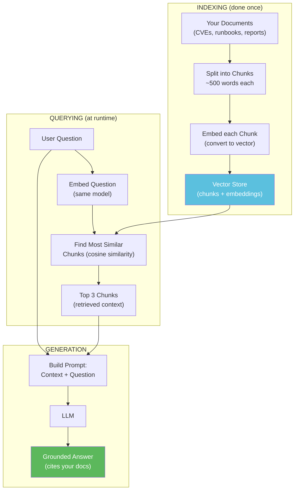

# Lesson 4.4 — RAG (Retrieval-Augmented Generation)

**Workshop:** [workshop/1_lab_guide.md](workshop/1_lab_guide.md)

---

## The Problem RAG Solves

Claude is powerful, but it has two limitations:
1. **Knowledge cutoff** — it doesn't know about CVEs published after its training date
2. **No internal knowledge** — it doesn't know your organisation's runbooks, policies, or past incidents

RAG (Retrieval-Augmented Generation) solves both by **retrieving relevant documents** and **injecting them into the prompt** before asking the question.

---

## How RAG Works



---

## The Components

### Chunking
Say you have loaded a CVE advisory as a long string of text. Embedding models have a token limit, so you split it into overlapping 500-word pieces before encoding. Overlap prevents a sentence that falls on a boundary from being cut in half:

```python
def chunk_text(text, chunk_size=500, overlap=50):
    words = text.split()
    chunks = []
    for i in range(0, len(words), chunk_size - overlap):
        chunks.append(' '.join(words[i:i + chunk_size]))
    return chunks
```

### Embedding
Now you have a list of chunks. Convert each one to a vector. Chunks that discuss similar topics will end up close together in this vector space — which is what makes retrieval possible:

```python
from sentence_transformers import SentenceTransformer
model = SentenceTransformer('all-MiniLM-L6-v2')
embeddings = model.encode(chunks)   # shape: (num_chunks, 384)
```

### Retrieval
A user asks a question. Encode it into the same vector space, then find the chunks whose vectors are closest to the question vector:

```python
def retrieve(question, embeddings, chunks, k=3):
    q_vec = model.encode([question])
    similarities = cosine_similarity(q_vec, embeddings)[0]
    top_k = similarities.argsort()[-k:][::-1]
    return [chunks[i] for i in top_k]
```

### Generation
You now have the 3 most relevant chunks. Paste them into the LLM's prompt alongside the question. The model reads them and answers from that material — not from its pre-training:

```python
context = "\n\n".join(retrieved_chunks)
prompt = f"""Based on the following context only, answer the question.
If the answer is not in the context, say so.

Context:
{context}

Question: {question}"""
```

---

## Why "Based on the context only" Matters

Without this instruction, Claude might blend its pre-training knowledge with the documents, making it impossible to know where the answer came from. Grounding the answer in your documents gives you:
- Attributable answers (you can verify the source)
- Accurate recall of your internal policies
- Reduced hallucination

---

## What to Notice When You Run It

1. The chunking — how many chunks does each document produce?
2. The retrieval — does the right chunk come back for each question?
3. The grounding — Claude says "Based on the provided context..." rather than hallucinating
4. Compare: answer with context vs without context (hallucination demo)

---

## Next: Milestone Project

**[milestone_security_assistant.py](../milestone/milestone_security_assistant.py):** A complete RAG-based security assistant you can load your own CVE data into and query.


---

## Ready for the Workshop?

You have covered the concepts. Now build it yourself.

**[Open workshop/1_lab_guide.md](workshop/1_lab_guide.md)**
