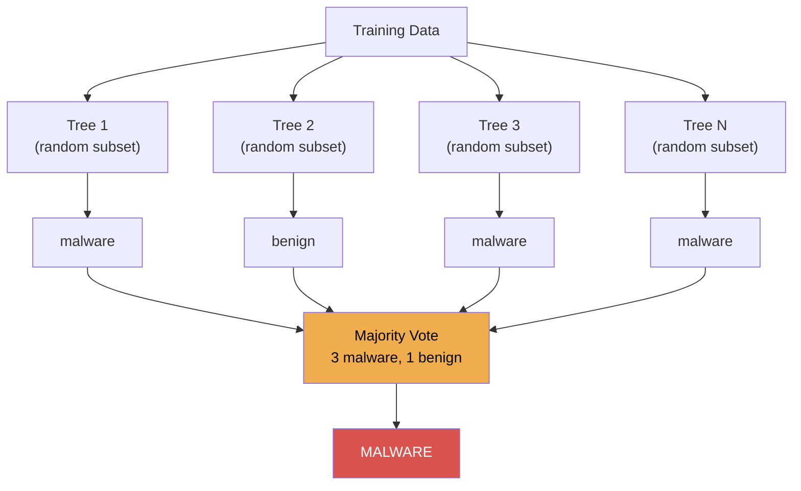

# Lesson 2.2 — Random Forests

---

## Concept: Wisdom of the Crowd

A single decision tree is like asking one analyst to classify a file. A **Random Forest** is like asking 100 analysts and taking a vote.

Each tree in the forest:
1. Is trained on a **random subset** of the training data (bootstrap sampling)
2. At each split, only considers a **random subset** of features

The final prediction is the majority vote (classification) or average (regression):



---

## Why This Is Better Than One Tree

| Problem with one tree | How Random Forest fixes it |
|-----------------------|---------------------------|
| Overfits training data | Each tree sees different data → ensemble averages out errors |
| Sensitive to small data changes | Random sampling creates diversity |
| One bad split ruins everything | Bad splits in one tree don't affect others |

Random Forest is one of the most reliable, out-of-the-box ML algorithms. It's the first thing many practitioners reach for on tabular data.

---

## Real-Life Example: Malware Classifier

Features extracted from a PE (Portable Executable) file:
- File entropy (high entropy = packed/encrypted)
- Import table features (which DLLs it uses)
- Section characteristics (executable sections, number of sections)
- File size, header properties

A Random Forest can catch patterns across many feature combinations that a single decision tree would miss.

---

## Key Concepts

### Out-of-Bag (OOB) Error
Each tree is trained on ~63% of the data. The remaining 37% can be used as a free validation set — no need for a separate test split during training.

```python
model = RandomForestClassifier(oob_score=True)
model.fit(X_train, y_train)
print(model.oob_score_)   # free accuracy estimate
```

### Feature Importance
More reliable than a single tree — averaged over all trees, so less sensitive to noise.

### n_estimators
More trees = better (up to a point), but slower. 100-300 is usually sufficient.

---

## Key sklearn API

Say you have extracted PE file features for 20,000 files — half malware, half benign — and stored them in a DataFrame. Each row is one file; the columns are things like `file_entropy`, `num_sections`, `has_network_imports`. Here's how you train the forest:

```python
from sklearn.ensemble import RandomForestClassifier

model = RandomForestClassifier(
    n_estimators=200,
    max_depth=None,      # let trees grow fully
    oob_score=True,
    n_jobs=-1,           # use all CPU cores
    random_state=42
)
model.fit(X_train, y_train)
```

---

## What to Notice When You Run It

1. Compare accuracy/AUC to the single decision tree from Lesson 1.4
2. The OOB score — this is a free generalisation estimate
3. Feature importances — which PE file properties are most suspicious?
4. The learning curve — how does performance change as you add more trees?

---

## Next Lesson

**[Lesson 2.3 — k-Means Clustering](../03_clustering_anomaly/README.md):** What if you have no labels at all? Unsupervised anomaly detection.

---

## Ready for the Workshop?

You have covered the concepts. Now build it yourself.

**[Open README.md](README.md)**

# Lesson 2.2 — Workshop Guide
## Malware vs Benign PE File Classifier with Random Forests

> Read first: [README.md](README.md)
> Reference: Each exercise has a matching solution file (e.g. `1_from_tree_to_forest/solve.py`)

## What This Workshop Covers

You will build a random forest classifier that distinguishes malware from benign PE (Portable Executable) files using static analysis features — file entropy, section count, imported functions, etc. You will see why a single decision tree overfits, how bagging solves this, and how to tune the forest size and feature selection.

## Exercise Overview

| # | Guide | Lab | Topic |
|---|-------|---------------|-------|
| 1 | [guide.md](1_from_tree_to_forest/guide.md) | [lab.md](1_from_tree_to_forest/lab.md) | Single tree overfitting demo, bagging concept |
| 2 | [guide.md](2_train_random_forest/guide.md) | [lab.md](2_train_random_forest/lab.md) | RandomForestClassifier, oob_score, tree vs forest accuracy |
| 3 | [guide.md](3_feature_importance/guide.md) | [lab.md](3_feature_importance/lab.md) | Stable importances, single tree vs forest stability |
| 4 | [guide.md](4_tune_the_forest/guide.md) | [lab.md](4_tune_the_forest/lab.md) | n_estimators sweep, max_features, learning curve |

## Running an Exercise

```bash
cd "C:/Users/admin/Desktop/AI Basic Training"
python stage2_intermediate/02_random_forests/1_from_tree_to_forest/solve.py
```

## Next Lesson

[Lesson 2.3 — Clustering and Anomaly Detection](../../03_clustering_anomaly/README.md)
